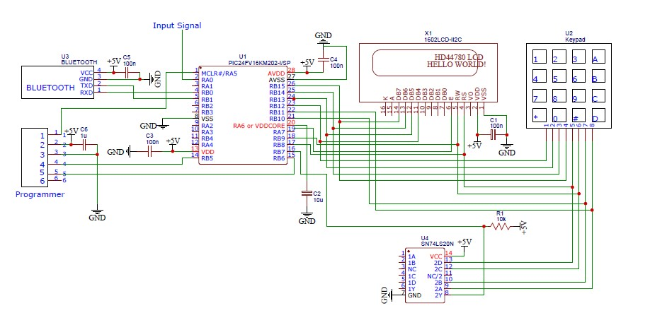
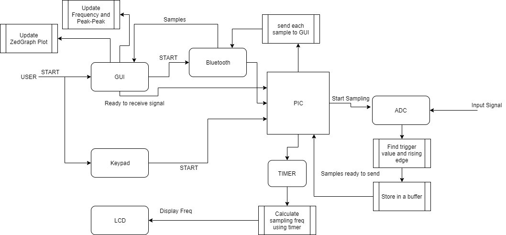

# Wireless-Digital-Oscilloscope-and-Spectral-Analyzer
 Designed a wireless digital oscilloscope and spectral analyzer using PIC24FV16KM202, Bluetooth, and C# GUI. 
 
This project is able to digitize analog signal and plot time domain signal and frequency domain signal in custom developed GUI on PC. It  provides important information about the signal and allow users to control the digitization process with various controls. Digitization occurs only when requested by user and can be stopped as per user request. When user starts the sampling process, GUI sends a signal to PIC to start digitization of samples. After receiving signal from GUI, PIC scans for trigger value and starts to collect the samples in a buffer. After collecting 200 samples, PIC sends data to GUI and then GUI stores all the samples into a buffer which is then used to calculate DFT magnitude and phase. After DFT calculation all the samples are plotted into a graph panel on GUI and the sampling process restarts again until user requests the system to stop sampling. 

The system consists of LCD, Bluetooth Module, PIC24FV16KM202 microcontroller, and a keypad. This system can digitize any input signals within the range of 100 Hz to 83KHz frequency and 0V to 5V amplitude. 8-bit ADC is used to acquire maximum possible sampling frequency. GUI can plot the digitized data, calculate DFT magnitude and phase and display the plot in a continuous mode without any sort of distortion. GUI consists of three buttons: Start/Stop, Clear, and Single to control sampling process and clear the graph panel. Moreover, there is a combo box in GUI for the user to select different sampling frequency, fs (maximum sampling frequency), fs/4, fs/16, and fs/100. Additionally, user can press 2 to increase sampling frequency and can press 3 to decrease sampling frequency by selecting provided options. Waveform for sampled analog signal includes two to ten cycles. Similarly, a trackbar is provided on GUI panel to control trigger value from 0 to 5V. Magnitude span of the oscilloscope can also be changed with 8 different scales: (2.5±2.5/1),  (2.5±2.5/2), (2.5±2.5/4), (2.5±2.5/8) , (2.5±2.5/16), (2.5±2.5/32), (2.5±2.5/64), (2.5±2.5/100). Horizontal and vertical axes are properly labeled with correct units in the GUI panel. Similarly, DFT magnitude plot in GUI is well displayed and can be chose between linear or logarithmic form. All forms of communication between PIC and GUI is carried out using a Bluetooth module. Additionally, GUI panel consists of three text boxes to display frequency and amplitude of input signal, and sampling frequency of PIC. 

![gui interface] (final_gui.JPG)
